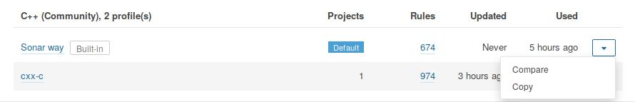

# Trabalho de Verificação e Validação - Analisadores Estáticos

## Utilizando os programas

### Clang Static Analyser - scan-build

Esta ferramenta é um analisador de código fonte que acha bugs em códigos C/C++. A última build disponível da ferramenta pode ser encontrada no [site oficial](https://clang-analyzer.llvm.org/). Também há uma versão em python da ferramenta desenvolvida nesse [repositório](https://github.com/rizsotto/scan-build)

##### Instalação
Para instalar a versão original:
```
sudo apt-get install clang-tools
```
Para instalar a versão em Python:

```
sudo apt-get install clang
pip install scan-build # O comando pip3 tambem pode ser utilizado
```

##### Utilização
Ambas as ferramentas apresentam a mesma forma de uso e diferem apenas em alguns argumentos que podem ser passados na chamada do programa. Para utilizá-la no gedit basta modificar o comando com o "ninja" para fazer a build:
```
ninja -C _build scan-build # build gedit and scan
```
Para instalar a versão em Python:

O projeto será compilado e a análise será salva em um diretório temporário. O endereço é dado no final da execução do programa. O relatório pode ser encontrado em **_build/meson-logs/scanbuild/** em formato html.

### Cppcheck

##### Instalação

```
sudo apt-get install cppcheck
```

##### Utilização
Diferente do **scan-build**, o **cppcheck** não precisa ser chamado junto com o build. Para utilizar o programa, basta passar como argumento na chamada do programa os diretórios a serem analisados. O programa irá percerorrer os diretórios recursivamente procurando por códigos fonte.

```
cppcheck -j4 gedit plugins 2> cppcheck-report.txt
```

* **-j4**: Cria 4 threads para analisar o programa
* **gedit plugins**: Diretórios analisados
* **2> cppcheck-report.txt**: Repassa o output do terminal para o arquivo cppcheck-report.txt

## Utilizando com o SonarQube

Para utilizar as ferramentas citadas com o SonarQube é preciso instalar o plugin [sonar-cxx](https://github.com/SonarOpenCommunity/sonar-cxx). As instruções de instalação podem ser encontradas [aqui](https://github.com/SonarOpenCommunity/sonar-cxx/wiki/Installation).

Além disso, também é preciso instalar o [sonar-scanner](https://docs.sonarqube.org/display/SCAN/Analyzing+with+SonarQube+Scanner#AnalyzingwithSonarQubeScanner-Installation) para analisar o repositório e incluir os dados no Sonar.

1. Inicie o SonarQube e faça o log in;
2. Verifique o arquivo **sonar-project.properties** na pasta raíz deste repositório. Ele contém comandos que o sonar identifica para a análise.
3. Com o terminal aberto na pasta raíz do projeto digite o comando ```sonar-scanner``` para cadastrar o projeto no Sonar. Verifique que agora ele aparece como repositório listado no programa.
4. Agora é preciso criar o conjunto de regras para poder ler os inputs gerados pelas ferramentas utilizadas. No menu superior vá em **Quality Profiles**.
5. Com o plugin **sonar-cxx** devidamente instalado, clique na caixa de menuno correspondente a linha "Sonar way" da tabela do C++ e clique em "copy" para criar um novo conjunto de regras a partir do padrão.



6. Clique em "Activate More"
7. Do lado esquerdo, em Language, ative **C (Community)** e em **Repository** ative (clique) em Cppcheck e Clang-SA. Se eles não estiverem presentes, utiliza a opção Search. Em seguida, desmarque **Quality Profile**. Outras opções em Repository podem ser marcadas dependendo dos softwares utilizados para realizar as análises.
8. Agora é preciso mudar o profile que nosso projeto irá utilizar. Em Projects > gedit > Administration > Quality Profiles, mude o profile utilizado para C++ e coloque o novo.

Com isso, agora é possível utilizar o sonar-scanner para adicionar os problemas encontrados pelas ferramentas ao Sonar. Agora é preciso rodar as ferramentas utilizadas da seguinte forma:

```
cppcheck -j4 gedit plugins vv --xml 2> vv/cppcheck-report.xml # Cria arquivo no diretorio vv/
export SCANBUILD="scan-build -plist --intercept-first --analyze-headers"
ninja -C _build scan-build
sonar-scanner
```

1. O cppcheck é rodado de novo e o output agora é um arquivo xml que é aceito pelo plugin sonar-cxx.
2. A variável SCANBUILD é exportada com argumentos. Isso é necessário pois não é possível passar argumentos para o scan-build utilizando o ninja (comando posterior).

Agora os resultados devem constar no SonarQube.


## Referências
1. [sonar-cxx wiki](https://github.com/SonarOpenCommunity/sonar-cxx/wiki)
2. [Clang Static Analyzer](https://clang-analyzer.llvm.org/scan-build.html)
3. [Cppcheck manual](http://cppcheck.sourceforge.net/manual.pdf)
