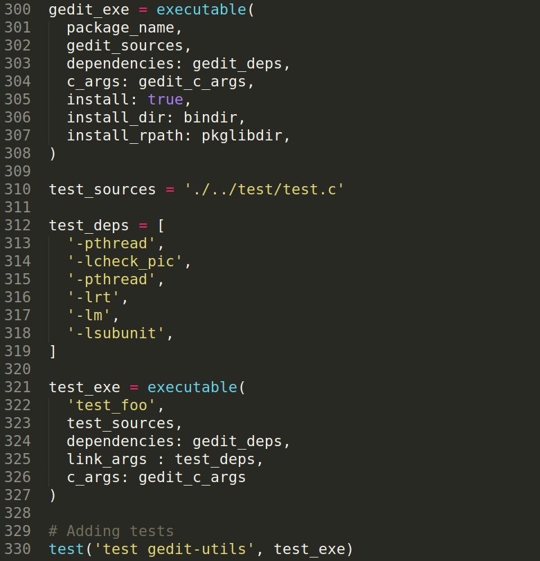

# Trabalho de Verificação e Validação - Teste Unitário

O objetivo deste texto é ilustrar um passo a passo de como efetuar o teste unitário na aplicação gedit. Testes unitários são uma boa forma de garantir o funcionamento de funções e verificar se o programa foi quebrado ou não por meio de modificações no futuro.

Trabalhar com esse tipo de teste na linguagem C é mais complicado do que com linguagens de mais alto nível pois o framework desenvolvido para testar precisa lidar com questões específicas da linguagem como:
* Isolamento de memória;
* Listar coisas aqui
[Fazer lista]

## Como realizar testes unitários em C?

Para realizar o teste unitário é preciso compilar a aplicação e gerar um programa executável que será, de fato, o teste. A diferença de compilação entre o executável da aplicação e o do teste reside na mudança da função main(). No executável da aplicação a main() é responsável por executar o programa e no do teste a main() será utilizada para chamar a rotina de testes. Portanto, tendo o projeto compilável o que é necessário para criar a suite de testes é uma main() que use algum framework de teste unitário para C.

Outra abordagem de compilar os testes em C é criar uma static library do programa a ser testado e linkar estaticamente com o programa de teste durante sua compilação. Esta abordagem é comumente vista em tutoriais pela internet e costuma ser usada. Ela tem a vantagem de a aplicação, uma vez compilada e gerada a static library, possa ser usada para a criação de diferentes testes.

## Tutorial

O tutorial a seguir ensina a criar testes unitários para o gedit da forma mais simples possível sem muitas modificações nos scripts do Meson (build system utilizado no projeto).

Foi utilizado o sistema operacional Ubuntu 18.04 na realização deste tutorial.

### Instalando o framework

O framework utilizado foi o [Check](https://libcheck.github.io/check/). A equipe optou por este framework pois o projeto apresenta uma boa documentação e fácil instalação, características essenciais para a reproducibilidade.

Para instalar o framework, abra o terminal e coloque:

```
sudo apt-get install Check
```

### Adaptando o Meson build system

Abra o arquivo ./gedit/meson.build. Ele contém os comandos necessários para compilar o executável do gedit. Iremos fazer pequenas alterações para que ele também gere um executável do programa de testes. Faça as alterações abaixo no final do arquivo:



Uma breve explicação do que ocorre no código:

```meson
gedit_exe = executable(
  package_name,
  gedit_sources,
  dependencies: gedit_deps,
  c_args: gedit_c_args,
  install: true,
  install_dir: bindir,
  install_rpath: pkglibdir,
)
```

Cria um executável com o nome da string contida em package_name utilizando gedit_sources e gedit_deps como código fonte a ser compilado. gedit_sources é uma variável definida neste mesmo script e corresponde ao arquivo gedit.c que contém a main() da aplicação.

As seguintes linhas foram adicionadas:

```meson
test_sources = './../test/test.c'

test_deps = [
  '-pthread',
  '-lcheck_pic',
  '-pthread',
  '-lrt',
  '-lm',
  '-lsubunit',
]

test_exe = executable(
  'test_foo',
  test_sources,
  dependencies: gedit_deps,
  link_args : test_deps,
  c_args: gedit_c_args
)

# Adding tests
test('test gedit-utils', test_exe)
```

test_sources é o endereço do .c que contém a main() do programa de testes. test_deps são as dependências, libraries linkadas durante a compilação, necessárias para compilar um programa que usa o framework. O comando abaixo cria um executável chamado "test_foo" com os arquivos de gedit e o código fonte do teste.

O último comando tem a função de informar ao Meson o executável do teste a ser rodado. Para adicionar um novo programa de testes basta criar um novo executable() e adicionar o executável criado ao teste suite do Meson com o comando test().

OBS: neste repositório o programa de testes se localiza em ./test/test.c.

### Rodando os testes

Para compilar e executar os testes basta usar o Meson e depois o ninja conforme mostrado abaixo:

```
meson _build
ninja -C _build test
```

## Conclusão

Este documento explica como incluir testes no repositório do gedit e já está configurado para rodar testes. Alguns links úteis:

1. Tutorial de como utilizar o Check: https://libcheck.github.io/check/doc/check_html/index.html
2. API do Check: https://libcheck.github.io/check/doc/doxygen/html/check_8h.html
3. Tutorial de teste unitário com o Meson: https://mesonbuild.com/Unit-tests.html
